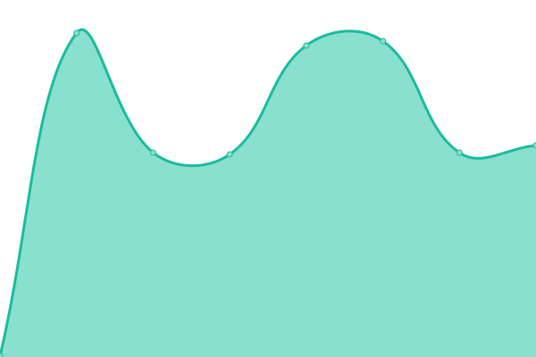
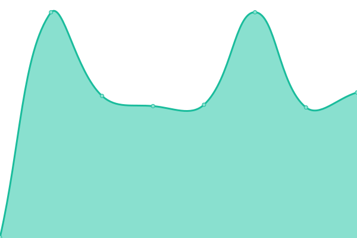
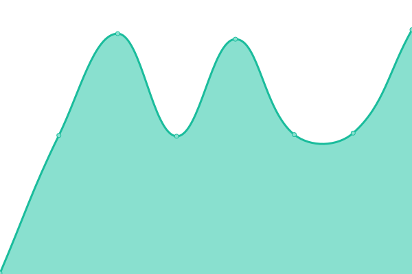

# [📈 Live Status](https://arianpasquali.github.io/upptime-monitor-example): <!--live status--> **🟧 Partial outage**

This repository contains the open-source uptime monitor and status page for [Arian Pasquali](https://arianpasquali.github.io/upptime-monitor-example), powered by [Upptime](https://github.com/upptime/upptime).

With [Upptime](https://upptime.js.org), you can get your own unlimited and free uptime monitor and status page, powered entirely by a GitHub repository. We use [Issues](https://github.com/arianpasquali/upptime-monitor-example/issues) as incident reports, [Actions](https://github.com/arianpasquali/upptime-monitor-example/actions) as uptime monitors, and [Pages](https://arianpasquali.github.io/upptime-monitor-example) for the status page.

<!--start: status pages-->
<!-- This summary is generated by Upptime (https://github.com/upptime/upptime) -->
<!-- Do not edit this manually, your changes will be overwritten -->
<!-- prettier-ignore -->
| URL | Status | History | Response Time | Uptime |
| --- | ------ | ------- | ------------- | ------ |
|  cl2-nlp (Epic) | 🟩 Up | [cl2-nlp-epic.yml](https://github.com/arianpasquali/upptime-monitor-example/commits/HEAD/history/cl2-nlp-epic.yml) | 

 226ms
     
 | 

<a href="https://arianpasquali.github.io/upptime-monitor-example/history/cl2-nlp-epic">100.00%</a>
    

|  cl2-nlp (Epic) [endpoint:tenants] | 🟩 Up | [cl2-nlp-epic-endpoint-tenants.yml](https://github.com/arianpasquali/upptime-monitor-example/commits/HEAD/history/cl2-nlp-epic-endpoint-tenants.yml) | 

 253ms
     
 | 

<a href="https://arianpasquali.github.io/upptime-monitor-example/history/cl2-nlp-epic-endpoint-tenants">100.00%</a>
    

|  cl2-nlp (Epic) [endpoint:tag_suggestions] | 🟩 Up | [cl2-nlp-epic-endpoint-tag-suggestions.yml](https://github.com/arianpasquali/upptime-monitor-example/commits/HEAD/history/cl2-nlp-epic-endpoint-tag-suggestions.yml) | 

 238ms
     
 | 

<a href="https://arianpasquali.github.io/upptime-monitor-example/history/cl2-nlp-epic-endpoint-tag-suggestions">100.00%</a>
    

|  cl2-nlp (Epic) [endpoint:zeroshot classification] | 🟥 Down | [cl2-nlp-epic-endpoint-zeroshot-classification.yml](https://github.com/arianpasquali/upptime-monitor-example/commits/HEAD/history/cl2-nlp-epic-endpoint-zeroshot-classification.yml) | 

 228ms
     
 | 

<a href="https://arianpasquali.github.io/upptime-monitor-example/history/cl2-nlp-epic-endpoint-zeroshot-classification">0.00%</a>
    

<!--end: status pages-->

[**Visit our status website →**](https://arianpasquali.github.io/upptime-monitor-example)

## 📄 License

- Powered by: [Upptime](https://github.com/upptime/upptime)
- Code: [MIT](./LICENSE) © [Arian Pasquali](https://arianpasquali.github.io/upptime-monitor-example)
- Data in the `./history` directory: [Open Database License](https://opendatacommons.org/licenses/odbl/1-0/)
